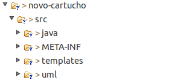
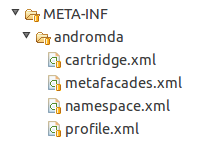
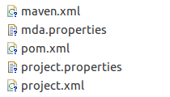
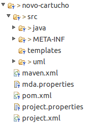
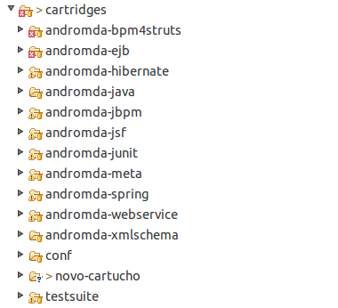
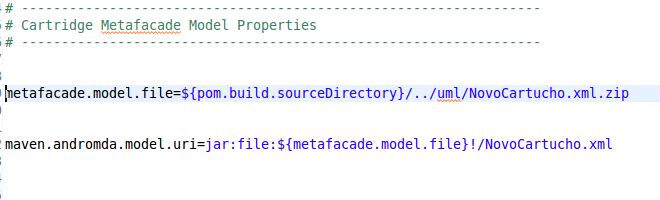
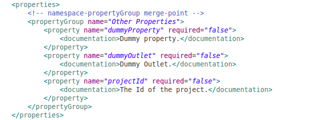
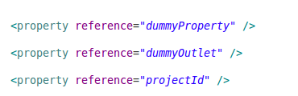

### Objetivo

Ao final desta apresentação você terá entendido o que é um cartucho do MDArte, como criar um novo cartucho e, por fim, terá criado um novo cartucho, inclusive com metafacades personalizados .

### Conteúdo

- O que é um Cartucho ?

- Estrutura Básica de um Cartucho

- Arquivos de Configuração do Cartucho

- Arquivos de Configuração para o Maven

- Criando um Novo Cartucho

	- Criando os Arquivos de Configuração do MDArte

	- Criando os Arquivos de Configuração do Maven

	- Criando a Primeira Transformação

	- Criando um Metafacade Personalizado
	
### O que é um cartucho ?

- Cartuchos são os componentes do \texttt{MDArte} responsáveis por dirigir a geração de código para a utilização de uma dada tecnologia.

- Cartuchos são compostos basicamente por arquivos de configuração, templates e, possivelmente, metafacades personalizados.

- O \texttt{MDArte} atualmente possui os seguintes cartuchos:
	
	- Bpm4Struts - utiliza o framework Struts 2 para organizar e disponibilizar um interface web através da tecnologia JEE;
	
	- EJB - utiliza a tecnologia EJB (nas versões 2 e 3) para organizar as regras de negócio e disponibilizá-las a camada de visão;
	
	- Hibernate - utiliza a tecnologia Hibernate 3.x para criar uma abstração entre o banco de dados relacional e as outras camadas da aplicação;
	
	- Java - utiliza a linguagem Java e gera elementos básicos seguindo alguns dos design patterns existentes;
	
### Estrutura Básica de um Cartucho

- Os cartuchos do \texttt{MDArte} devem seguir uma mesma estrutura básica de diretórios e arquivos de configuração. 

[columns]

[column=0.6]

[/columns]

- O uso da estrutura de diretórios padrão permite ao framework identificar o cartucho e saber como tratá-lo sem a necessidade de configurações adicionais.

### Estrutura Básica de um Cartucho

- A Estrutura básica de diretórios do cartucho se dá da seguinte forma:

	- src - Diretrório que contém todos os arquivos que compõem o cartucho;
	
	- src > java - Diretório que armazena os arquivos Java para os metafacades do cartucho;
	
	- src > templates - Diretório que armazena os templates responsáveis pela geração dos arquivos finais produzidos pelo cartucho;
	
	- src > META-INF > andromda - Diretório que armazena os arquivos que configuram o mapeamentos e transofrmações feitos pelo cartucho a fim de gerar o código final da aplicação;
	
	- src > uml - Diretório que contém o modelo UML responsável por descrever os metafacades personalizados e quaisquer outras classes modeladas especificamente para o cartucho em construção.

### Arquivos de Configuração do Cartucho

- Como já vimos, um cartucho do \texttt{MDArte} deve possuir alguns arquivos \texttt{XML} a fim de configurar os comportamentos de mapeamento e transformações do cartucho. 

[columns]

[column=0.4]

[/columns]

### Arquivos de Configuração do Cartucho

- Um cartucho típico contém os seguintes arquivos de configuração:

	- \texttt{namespace.xml} - Arquivo XML é responsável por registrar as propriedades e variáveis globais que estarão disponíveis para os templates do cartucho, bem como registrar os componentes do mesmo;

	- \texttt{profile.xml} - Arquivo XML é reponsável por registrar os estereótipos e valores etiquetados que serão usados pelo cartucho na interpretação do modelo UML do sistema;

	- \texttt{cartridge.xml} - Arquivo XML responsável por configurar as transformações a serem realizadas pelo cartucho, bem como propriedades e demais classes e bibliotecas de macros utilizadas como elementos auxiliares no processo de geração do código;
	
	- \texttt{metafacades.xml} - Arquivo XML responsável configurar as regras de mapeamento das classes de metamodelo para os metafacades utilizados pelo cartucho.
	
### Arquivos de Configuração para o Maven

- Como já sabemos, o \texttt{MDArte} faz uso da ferramenta Maven a fim de automatizar o processo de geração e compilação dos sistemas desenvolvidos e dos próprios cartuchos do frmaework;

- Para que que o Maven possa automatizar corretamente o processo de geração do cartucho, alguns arquivos de configuração extra se fazem necessários;

[columns]

[column=0.4]

[/columns]

### Arquivos de Configuração para o Maven

- São necessários os seguintes arquivos de configuração (localizados na pasta raiz do cartucho):
	
	- \texttt{maven.xml} - Arquivo XML responsável por definir quais tipos de \texttt{goals (clean , install etc.)} o Maven executará para o cartucho;
	
	- \texttt{mda.properties} e \texttt{project.properties} - Arquivos de propriedades com caminhos de diretórios usados na compilação e do modelo UML do cartucho;
	
	- \texttt{pom.xml} - Arquivo XML reponsável por descrever o projeto sendo automatizado para o Maven, contendo desde informações sobre os desenvolvedores e a url onde o projeto reside, até arquivos de configuração e algumas dependências de projeto. ;

	- \texttt{project.xml} - Arquivo XML reponsável por registrar as dependências e outras características específicas do projeto sendo desenvolvido.

### Criando um Novo Cartucho

- Usaremos uma estrutura básica com todos os diretórios e arquivos necessários para criar um novo cartucho, disponibilizada pelo \texttt{MDArte} no diretório \texttt{mdarte > samples > novo-cartucho}.

[columns]

[column=0.3]

[/columns]

### Criando um Novo Cartucho

- Começaremos copiando o sample \texttt{novo-cartucho} para dentro do diretório \texttt{mdarte > cartridges};

- Teremos então a seguinte configuração do diretório \texttt{mdarte > cartridges} :

[columns]

[column=0.5]

[/columns]

### Editando os Arquivos \texttt{.properties}

- Começaremos editando ambos os arquivos \texttt{.properties} a fim de configurar algumas propriedades que serão usadas pelo \texttt{Maven} na descoberta e processamentos do modelo UML do cartucho.

- Temos interesse em 2 propriedades em especial:
	
	- \texttt{metafacade.model.file} - Define o caminho para o arquivo \texttt{xml.zip} que empacota o modelo UML do cartucho.
	
	- \texttt{maven.andromda.model.uri} - Define o caminho, dentro do \texttt{xml.zip} para o arquivo UML do cartucho. 

### Editando os Arquivos \texttt{.properties}

- Os arquivos \texttt{mda.properties} e \texttt{project.properties} fornecidos pelo \texttt{MDArte} possuem as propriedades já citadas configurados da seguinte forma:

[columns]

[column=0.8]

[/columns]

- Para mudar o nome dos arquivos com o modelo basta renomeá-los no diretório onde se encontram e mudar as propriedades \texttt{metafacade.model.file} e \texttt{maven.andromda.model.uri}, a fim de que reflitam as mudanças feitas.

### Editando o \texttt{project.xml}

- Agora editaremos o \texttt{project.xml} para customizar as informações básicas do cartucho, bem como dependências adicionais para o mesmo.

- No momento, estamos interessados em editar as seguintes propriedades definidas nas seguintes tags do \texttt{XML} default:

	- artifactId - Define o nome que será dado ao arquivo compilado final do cartucho em desenvolvimento.
	
	- name - Nome do cartucho em desenvolvimento.

	- shortDescription - Descrição curta sobre o cartucho e sua finalidade.
	
	- description - Descrição completa sobre o cartucho e sua finalidade.
	
	- developers - Lista composta de tags \texttt{developer} que documentam informações básicas sobre os desenvolvedores do cartucho.
	
### Editando o \texttt{pom.xml}

- No \texttt{pom.xml}, customizaremos também algumas propriedades básicas que definem informações sobre o cartucho.

- No momento, estamos interessados em editar as seguintes propriedades definidas nas seguintes tags do \texttt{XML} default:

	- artifactId - Define o nome que será dado ao arquivo compilado final do cartucho em desenvolvimento. Deve conter o mesmo valor já definido no \texttt{project.xml}.
	
	- name - Nome do cartucho em desenvolvimento. Deve conter o mesmo valor já definido no \texttt{project.xml}.
	
	- description - Descrição sobre o cartucho e sua finalidade.

### Editando o arquivo \texttt{namespace.xml}

- No \texttt{namespace.xml}, configuraremos algumas propriedades que serão usadas como variáveis globais do cartucho.

- Editaremos a a tag \texttt{propertyGroup}, inserindo dentro dela algumas tags \texttt{property} definindo propriedades que usaremos nas transformações criadas a seguir.

- Configuraremos as seguintes propriedades :

	- projectId - Propriedade global do MDArte. Contém o id do projeto, fornecido ao MDArte quando da execução do plugin criação de projetos;
	
	- dummyOutlet - Diretório onde serão criados os arquivos gerados a partir dos templates que criaremos a seguir.
	
	- dummyProperty - Propriedade booleana que criaremos a título de exemplo.

### Editando o arquivo \texttt{namespace.xml}

- O \texttt{XML} usado para configurar as propriedades é o seguinte:

[columns]

[column=1.0]

[/columns]

### Editando o arquivo \texttt{cartridge.xml}

- Editaremos o \texttt{cartridge.xml} a fim de habilitar a referência às propriedades que já configuramos antes no \texttt{namespace.xml}.

- O \texttt{XML} usado para configurar as referências às propriedades é o seguinte:  

[columns]

[column=0.7]

[/columns]

### Criando a Primeira Transformação

### Criando um Metafacade Personalizado

<!-- vim: set spell spelllang=pt_br: -->
